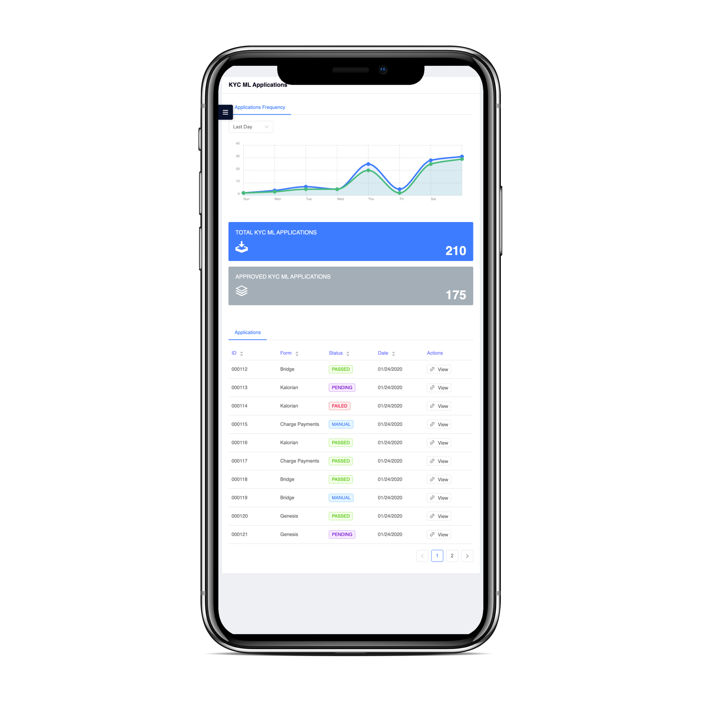

<h1 align="center">
  Charge Documentation
</h1>

  :credit_card: :money_with_wings: **Welcome to Charge!** :money_with_wings: :credit_card: 

  :star: Star us on GitHub — it helps!

  <h4>
    
    
    

  </h4>

   
  
  
  

---

  
  [Charge](https://www.charge.io) envisions a world where consumers, merchants, and financial institutions can fully trust online payments without the uncertainty of fraud:

  **Consumers**
  :couple:
  Only you can spend your money :money_with_wings:

  **Merchants**
  :convenience_store:
  No more unexpected chargebacks from the bank. Keep the money you make :credit_card: 

  **Financial Institutions**
  :bank:
  Stop criminals from stealing your time and money. Keep your customers happy :chart_with_upwards_trend:

---

Charge offers merchants, consumers, and issuing banks a much needed solution to the abuse and frictions suffered when participating in commerce online, including:

:white_check_mark: Card Not Present Fraud

:white_check_mark: Counter Money Laundering

:white_check_mark: Reduce Friendly Fraud

:white_check_mark: Reduce Refund Fraud

:white_check_mark: Solves Usability Friction

:white_check_mark: NFT Ready

:white_check_mark: KYC/KYB out of the box

:fire:
The Charge Apps
:fire:

| Charge Payments <button name="button">[docs](./docs/charge_payments.md)</button> | Charge Identity <button name="button">[docs](./docs/charge_identity.md)</button> | Charge Wallet <button name="button">[docs](./docs/charge_wallet.md)</button> |
|:--------------------------------------------------------------------------------:|:--------------------------------------------------------------------------------:|:----------------------------------------------------------------------------:|
|               |               |             |

---

> [charge.io](https://www.charge.io) &nbsp;&middot;&nbsp;
> [info@charge.io](mailto:info@charge.io?subject=[GitHub]) &nbsp;&middot;&nbsp;
> [payments@charge.io](mailto:payments@charge.io?subject=[GitHub]) &nbsp;&middot;&nbsp;
> [wallet@charge.io](mailto:wallet@charge.io?subject=[GitHub]) &nbsp;&middot;&nbsp;
> [identity@charge.io](mailto:identity@charge.io?subject=[GitHub])

