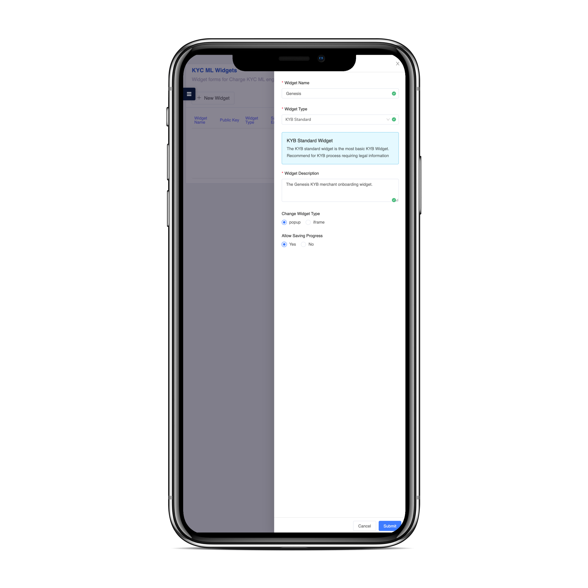

Charge Identity is a machine learning powered KYC/KYB Widget for onboarding merchants and customers.

<p align="center">
   
  
</p>


| Feature                                  |    Charge Identity |
|:-----------------------------------------|-------------------:|
| Transaction Monitoring                   | :white_check_mark: |
| KYC: Sanctions and PEP screening         | :white_check_mark: |
| KYC: Identity Validation US/Mexico)      | :white_check_mark: |
| KYC: Identity Validation                 | :white_check_mark: |
| KYC: Document Validation and Selfie      | :white_check_mark: |
| Virtual Currency Risk Assessment (VCRA)  | :white_check_mark: |
| ID Analytics Certain ID                  | :white_check_mark: |
| ID Analytics ID Score                    | :white_check_mark: |
| Device Fingerprint                       | :white_check_mark: |
| MaxMind MinFraud                         | :white_check_mark: |
| Document Validation Manual               | :white_check_mark: |
| Open Corporates                          | :white_check_mark: |
| Phone Out of Bound Verification (SMS US) | :white_check_mark: |
| Neustar CQR                              | :white_check_mark: |
| Neustar Info Email                       | :white_check_mark: |
| TeleSign PhoneID Contact                 | :white_check_mark: |
| TeleSign PhoneID Standard                | :white_check_mark: |
| Towerdata                                | :white_check_mark: |
| TIN Check                                | :white_check_mark: |


---

<div align="center">
  
  :star: Widget Builder :star:

</div>

To build your custom KYC/KYB widget, login into your dashboard and select a New Standard Widget:

<p align="center">
   
</p>

Now you can customize your Widget's panels, add manual document checks, and select specific checks:

<p align="center">
   
</p>

When you are ready you can deploy your widget, and include it as a simple cross domain component.

Include the source in your `index.html`

```html
<!doctype html>
<html lang="en">
  <head>
    <meta charset="utf-8">
    <meta name="viewport" content="width=device-width, initial-scale=1">
    <link rel="shortcut icon" href="%PUBLIC_URL%/favicon.png">
    <title>My Checkout Store</title>
  </head>
  <body>
    <div id="root"></div>
    <script src="https://cdnjs.charge.io/checkout/charge-identity-widget.frame.js"></script>
  </body>
</html>
```

And now your Widget can be rendered for users to complete:

```jsx
import React from 'react'
import ReactDOM from 'react-dom'
import { Helmet } from 'react-helmet'
import styles from './style.module.scss'

const ChargeIdentityComponent = window.ChargeIdentityWidget.WidgetComponentFrame.driver('react', {
  React,
  ReactDOM,
})

class WidgetPreview extends React.Component {
  render() {

    return (
      <ChargeIdentityComponent env={process.env.NODE_ENV} widgetPublicKey={widgetPublicKey} />
    )
  }
}

export default WidgetPreview
```

<p align="center">
   
</p>

Log into your dashboard to monitor your Widget's stats and ML feedback:

<p align="center">
   
</p>

<div align="center">

> [charge.io](https://www.charge.io) &nbsp;&middot;&nbsp;
> [info@charge.io](mailto:info@charge.io?subject=[GitHub]) &nbsp;&middot;&nbsp;
> [payments@charge.io](mailto:payments@charge.io?subject=[GitHub]) &nbsp;&middot;&nbsp;
> [wallet@charge.io](mailto:wallet@charge.io?subject=[GitHub]) &nbsp;&middot;&nbsp;
> [identity@charge.io](mailto:identity@charge.io?subject=[GitHub])

</div>
