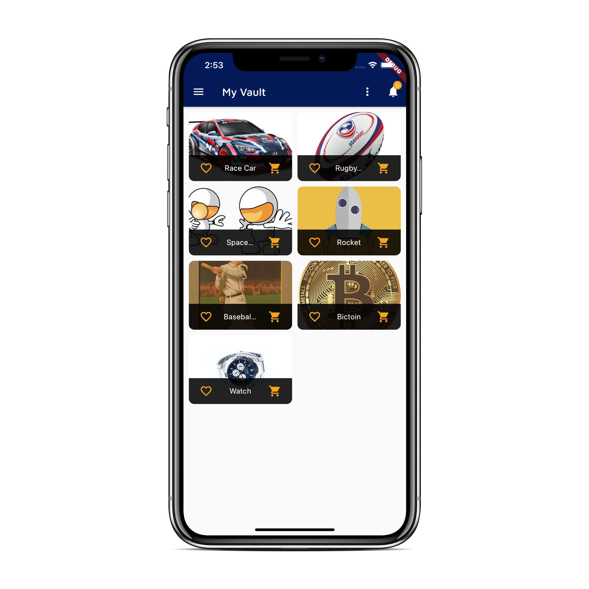
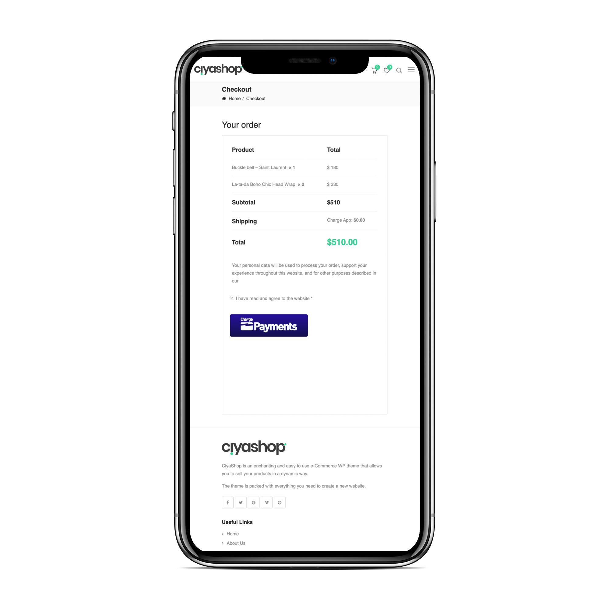
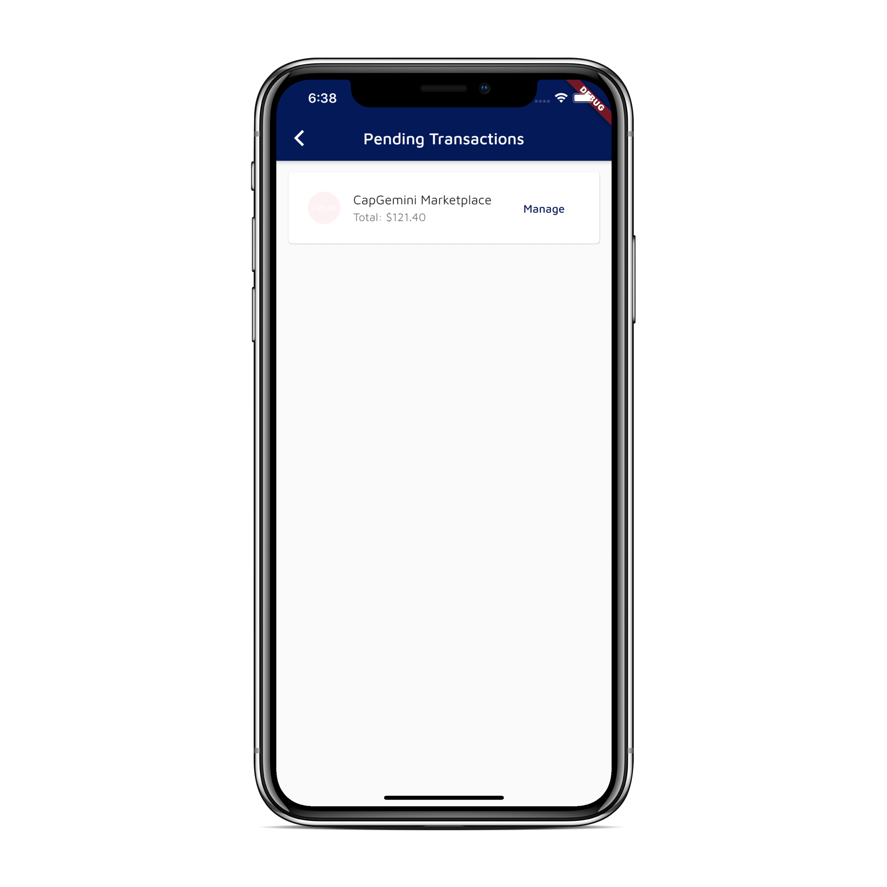
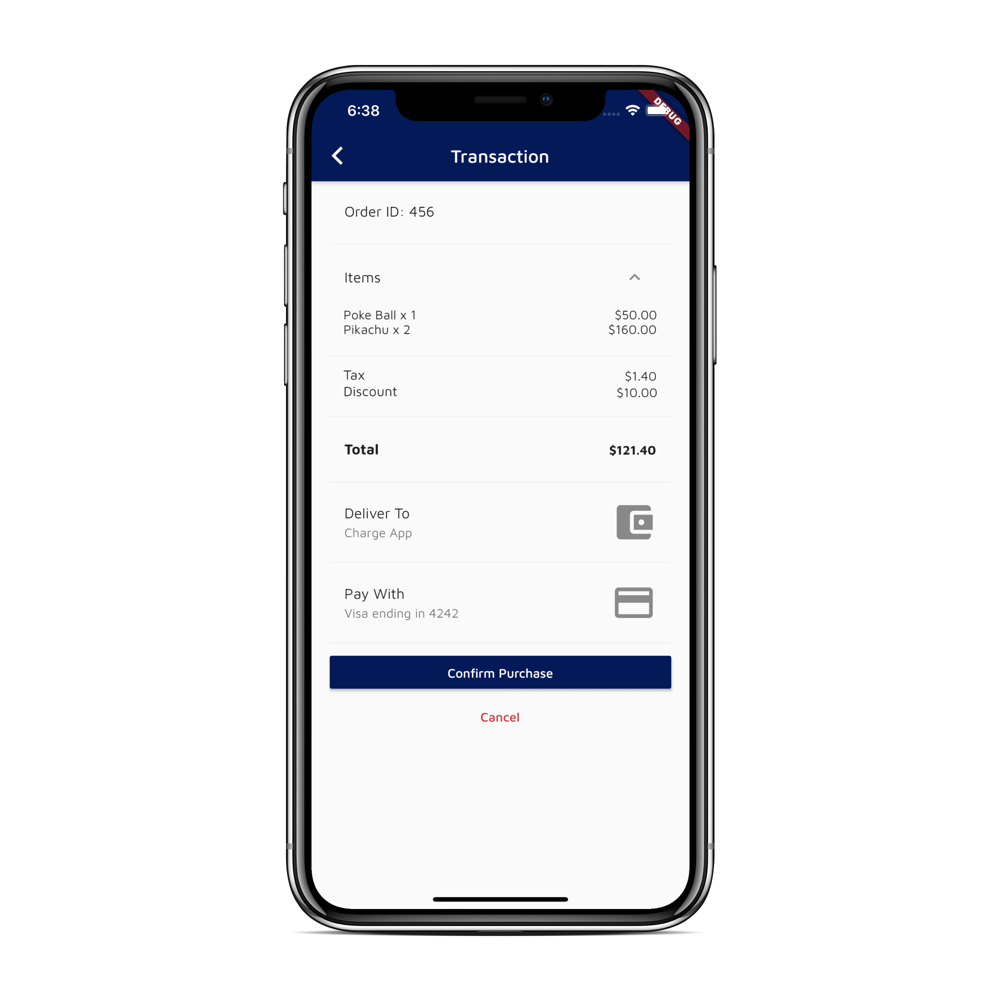

The Charge Wallet :briefcase: (also the Charge app) is Charge's mobile app which allows users to pay for their items and to store their assets.

<p align="center">
   
  
</p>

The Charge Wallet is based around the :key: Key Management System (KMS) :key: 

## Key Management System :key: 
The KMS main responsibility is

:lock: **Cryptographically secure your items in the Vault** :lock:

### Constructor & Public Methods

The `KeyManagement` class ensures a singleton instance of the class which uses a public factory constructor with a private regular constructor:

```dart
class KeyManagementSystem with ChangeNotifier {
  ...
  static KeyManagementSystem _instance;

  factory KeyManagementSystem() => _instance ??= KeyManagementSystem._();

  KeyManagementSystem._();
  ...
}
```

This means that by calling `KeyManagementSystem()` will always result in the same instance. `??=` means that `KeyManagementSystem._()` is only executed when `_instance` is `null` and if its executed the result will be assigned to `_instance` before it is returned to the caller.

The public methods are:
```dart
// generates a new instance of a KMS
void generateInitialKMS((String encryptionKey)
```

```dart
// encrypt decrypted data
String encrypt(String encryptionKey, String data)
```

```dart
// decrypts the encrypted data
String decrypt(String encryptionKey, String data) 
```

### Vault & Vault Items :closed_lock_with_key:
The Vault responsibilities are:

1. Generate a default Vault for first time use
2. Translate between `JSON` and `Vault Item` objects
3. `POST` and `GET` the Vault from the server

The Vault holds a `List` of Vault Items defined by:

```dart
class VaultItem {
  final String label;
  final VaultTypes type;
  final Map<String, String> meta;

  VaultItem({
    @required this.label,
    @required this.type,
    @required this.meta,
  });
```

The `meta` field is specific to the particular `Vault Item`. Currently the defined `Vault Items` are:

```dart
enum VaultTypes { CryptoWallet, CreditCard, ACH, Bank }
```

- `CryptWallet.meta`: `{phrase: 'mnemonic'}`

The public methods are:

```dart
// POST a Vault object to the server
// body: json.encode(
//   {
//     'data': encryptedData,
//     'key': key,
//     'vector': iv,
//   },
// ),
Future<void> postVault(String encryptedData) async
```

```dart
// GET Vault object(s) from server
// [
//     {
//         "id": "04a5bfdc-a3a4-4351-9723-a0260f6050d9",
//         "object": "vault",
//         "userId": "775671ff-f70d-415d-b523-f50b05139ac9",
//         "data": "...WfzY=",
//         "vector": "...WmdlKZsBk0KOx9MbCBn5A==",
//         "encryptionKey": "...47f0abb"
//     }
// ]
Future<void> getVault() async
```

## Flow

A User is browsing a cool online merchant store, and finds something they like to buy:

<p align="center">
   
</p>


Luckily, the merchant has integrated with :money_with_wings: Charge Payments :money_with_wings: 
So the user is confident that there is no chance of fraud. After clicking the Checkout with Charge button, the user gets a push notification to their Charge App

<p align="center">
   
  
</p>

The user then simply selects a Payment method stored in their Vault and securely pays for their items.

<div align="center">

> [charge.io](https://www.charge.io) &nbsp;&middot;&nbsp;
> [info@charge.io](mailto:info@charge.io?subject=[GitHub]) &nbsp;&middot;&nbsp;
> [payments@charge.io](mailto:payments@charge.io?subject=[GitHub]) &nbsp;&middot;&nbsp;
> [wallet@charge.io](mailto:wallet@charge.io?subject=[GitHub]) &nbsp;&middot;&nbsp;
> [identity@charge.io](mailto:identity@charge.io?subject=[GitHub])

</div>
